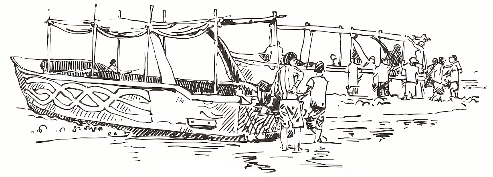

Hi there, I'm Abenav! I'm a developer and writer from [Tkarón:to](https://decolonialatlas.wordpress.com/2015/02/04/haudenosaunee-country-in-mohawk-2/) (colonially known as Toronto), Canada.

<!-- This note is just for me: Remember to update the portfolio section next month. Read this land acknowledgement: https://anisetozaatar.com/land-acknowledgement/-->

I graduated from the [[University of Toronto]] with a bachelor's degree in Computer Science.

I'm currently working as a developer at [[Dayforce]]. During my undergraduate years, I had the privilege of interning at [[Questrade Financial Group]], [[Basis Technologies]] and the [[Government of Canada]].

Thank you for visiting my site! Feel free to check out some of the [[technical projects|technical projects]] I've been working on, my [[resume|resume]], or get in [touch with me](mailto:abenav123[at]gmail.com).

If you're so inclined, my [[writing\]] can be found here.

---

[github](https://github.com/abenav4) | [linkedin](https://www.linkedin.com/in/abenav) | [email](mailto:abenav123[at]gmail.com)
